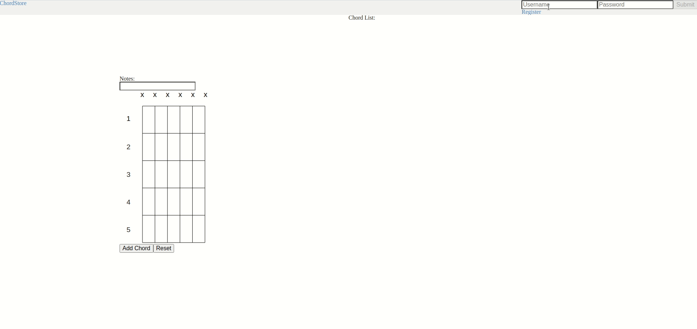

# reCHORDing [WIP]

reCHORDing is a tool for guitarist to quickly create chord diagrams with built in chord identification.
It is still a work in progress, but currently I have implemented the chord input diagram, chord identification, and a simplified form of cloud and local storage.



### Config
Create a 'variables.env' file on the project root dir, it should contain:

```js
DATABASE=database_uri

SALTROUNDS=10
JWT_KEY=jwt_key
```

### Start
Install the dependencies in the project root folder and the client folder, and run ```npm run start``` in the in the project root folder.
